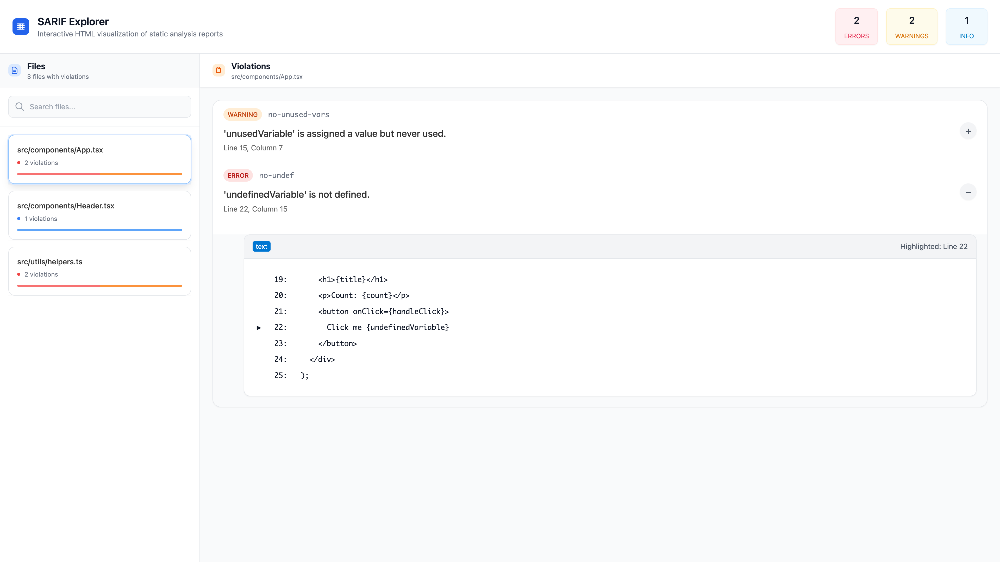
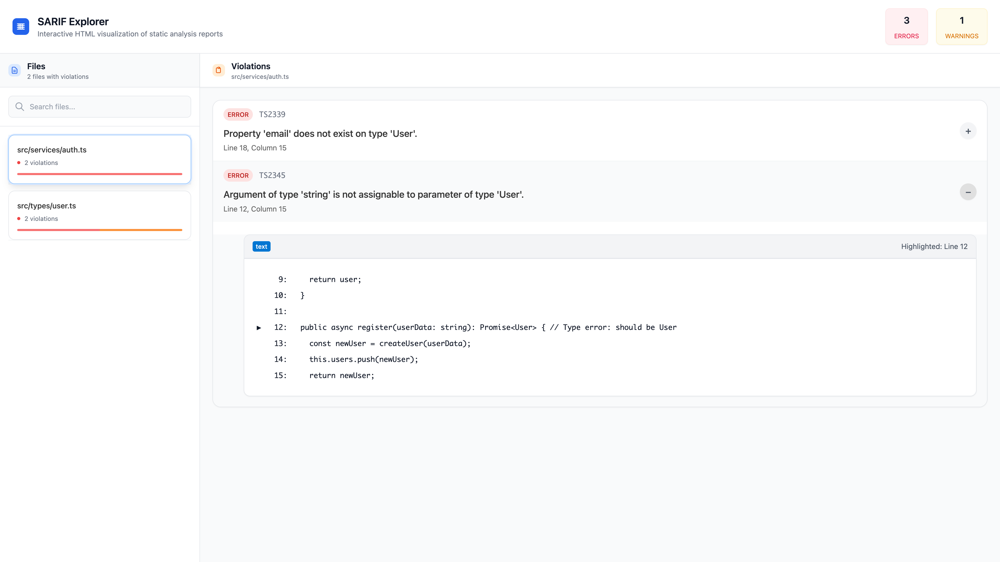
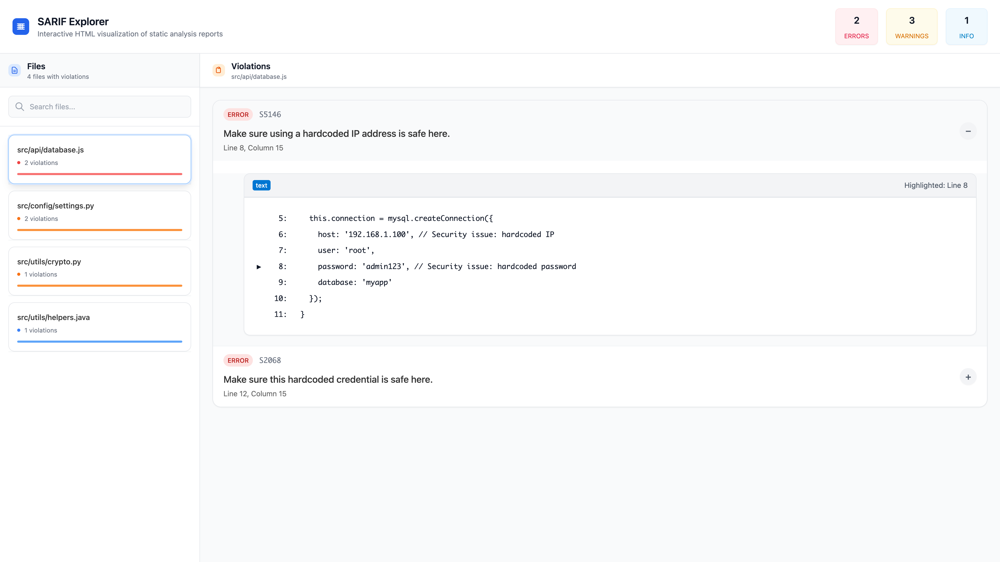

# SARIF Explorer


A simple, zero-dependency Node.js CLI that converts SARIF reports into interactive, shareable HTML reports with file explorer and collapsible issue details.


## 🚀 Features

### 1. Modern UI Design
- Clean, minimalist interface
- Light theme with subtle shadows
- Responsive design for all screen sizes
- Color-coded issue types (warnings, errors, vulnerabilities)

### 2. Interactive File Tree
- Expandable/collapsible file structure
- Violation indicators on files
- File count and violation counts
- Easy navigation between files

### 3. Violation Details
- Syntax-highlighted code snippets
- Line-specific highlighting
- Violation severity indicators
- Rule ID and description
- File path and line numbers

### 4. Statistics Dashboard
- Total violation counts
- Breakdown by severity level
- File count with issues
- Real-time statistics


## 📦 Installation

### Using npx (Recommended)
The easiest way to use SARIF Explorer without installing anything globally:

```bash
npx sarif-explorer --input path/to/report.sarif --output report.html
```

### Global Installation
Install globally for system-wide access:

```bash
npm install -g sarif-explorer
```

### Local Installation
Install as a project dependency for team consistency:

```bash
# Install as dev dependency
npm install --save-dev sarif-explorer

# Add to package.json scripts
# "scripts": {
#   "analyze": "sarif-explorer --input eslint-report.sarif --output public/analysis.html"
# }
```


## 👀 Screenshot


*ESLint analysis with syntax highlighting and file navigation*


*TypeScript compiler analysis with type checking issues*


*Security analysis with critical vulnerability highlighting*


## 🛠️ Usage

```bash
npx sarif-explorer --help
  ____    _    ____  ___ _____   _______  ______  _     ___  ____  _____ ____  
 / ___|  / \  |  _ \|_ _|  ___| | ____\ \/ /  _ \| |   / _ \|  _ \| ____|  _ \ 
 \___ \ / _ \ | |_) || || |_    |  _|  \  /| |_) | |  | | | | |_) |  _| | |_) |
  ___) / ___ \|  _ < | ||  _|   | |___ /  \|  __/| |__| |_| |  _ <| |___|  _ < 
 |____/_/   \_\_| \_\___|_|     |_____/_/\_\_|   |_____\___/|_| \_\_____|_| \_\
                                                                               
Convert SARIF reports into an interactive HTML viewer

Usage: sarif-explorer [options]

Convert SARIF reports into an interactive HTML viewer

Options:
  -V, --version            output the version number
  -i, --input <path>       Path to SARIF report file (default: "")
  -o, --output <path>      Path for generated HTML file (default: "")
  -s, --source-dir <path>  Source directory for loading artifact files (default: SARIF file
                           directory) (default: "")
  --no-snippets            Exclude code snippets in the report
  -v, --verbose            Enable verbose logging (default: false)
  -h, --help               display help for command
```

### `--no-snippets`
Use this flag when you want to generate a lightweight report without code snippets. This is useful for:
- **Large reports**: When dealing with thousands of violations to reduce file size
- **Performance**: Faster generation and loading for reports with many issues
- **Privacy**: When sharing reports that shouldn't include source code
- **Compliance**: Meeting requirements that exclude source code from reports

### `--source-dir <path>`
Specify a custom source directory when your SARIF file references files relative to a different location. Use this when:
- **Build artifacts**: SARIF files generated in CI/CD reference files from different paths
- **Cross-platform**: Referenced files in the SARIF report do not align with your local file structure
- **Monorepos**: When your SARIF report references files in nested packages or subdirectories
- **Custom layouts**: Your project structure differs from the analysis environment

## Integration Examples

### CI/CD Pipeline Integration

```bash
# Generate report in CI pipeline
npm install -g sarif-explorer
sarif-explorer --input eslint-report.sarif --output public/analysis.html

# Serve the report
npx serve public/
```

### GitHub Actions Integration

```yaml
- name: Generate SARIF Report
  run: |
    npx sarif-explorer --input eslint-report.sarif --output public/analysis.html
    
- name: Deploy Report
  uses: peaceiris/actions-gh-pages@v3
  with:
    github_token: ${{ secrets.GITHUB_TOKEN }}
    publish_dir: ./public
```

### Local Development

```bash
# Watch for changes and regenerate
nodemon --watch src/ --exec "npm run build:cli && node cli.js --input test.sarif --output report.html"
```

## 🚀 Quick Start

The [`examples/`](./examples/) folder contains sample SARIF files and generated HTML reports to demonstrate SARIF Explorer's capabilities. 

### 1. Generate HTML Reports

```bash
# Generate HTML report from ESLint sample
sarif-explorer --input examples/eslint-sample.sarif --output examples/eslint-sample.html

# Generate HTML report from TypeScript sample
sarif-explorer --input examples/typescript-sample.sarif --output examples/typescript-sample.html

# Generate HTML report from security analysis
sarif-explorer --input examples/security-sample.sarif --output examples/security-sample.html

# Generate HTML report from multi-tool analysis
sarif-explorer --input examples/multi-tool-sample.sarif --output examples/multi-tool-sample.html
```

### 2. View Generated Reports

Open any of the generated HTML files in your web browser:

```bash
# On macOS
open examples/eslint-sample.html

# On Linux
xdg-open examples/eslint-sample.html

# On Windows
start examples/eslint-sample.html
```


## Customization

The tool supports customization through:
- CSS variables for theming
- Configurable violation colors
- Customizable layout options
- Extensible component system for advanced customization


## Troubleshooting

### Common Issues

1. **CLI not found**: Run `npm run build:cli` first
2. **Empty report**: Check SARIF file format and content
3. **Missing files**: Ensure all referenced files exist in the SARIF
4. **Large file issues**: Consider splitting large reports

### Debug Mode

```bash
# Enable debug logging
DEBUG=sarif-explorer node cli.js --input file.sarif --output report.html
```

If you encounter unexpected behavior, please open an issue on GitHub with relevant details.


## 🤝 Contributing

PRs, feature suggestions, and improvements are welcome! Please open an issue or check [CONTRIBUTING.md](CONTRIBUTING.md) for guidelines.


## ⭐ Support the Project

If you find this tool helpful, star the repo and share with your team!
